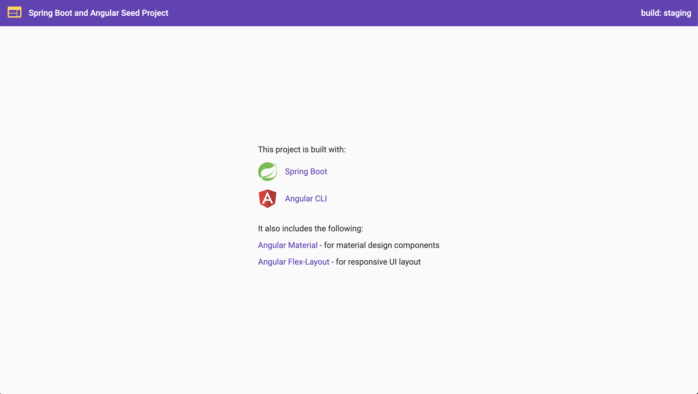

# Spring Boot and Angular

This is a seed project using <a href="https://start.spring.io" target="_blank">Spring Boot</a> for backend and <a href="https://angular.io" target="_blank">Angular</a> for frontend.

The frontend is created using <a href="https://cli.angular.io" target="_blank">Angular CLI</a>.  It provides named build configurations for development, staging,
and production environments respectively:

- environment.ts
- environment.staging.ts
- environment.prod.ts

The project uses the following:

- <a href="https://material.angular.io" target="_blank">Angular Material</a> for material design components
- <a href="https://github.com/angular/flex-layout" target="_blank">Angular Flex-Layout</a> for responsive UI layout

## Preview

## Build

To build the project for staging, run `mvn clean install -Pnpm-build-staging`.

To build the project for production, run `mvn clean install -Pnpm-build`.

The build artifacts will be stored in the `target/` directory.

## Run

Run the following in the command prompt:

`java -jar target/springbootangular-0.0.1-SNAPSHOT.jar`

Navigate to http://localhost:8080/.